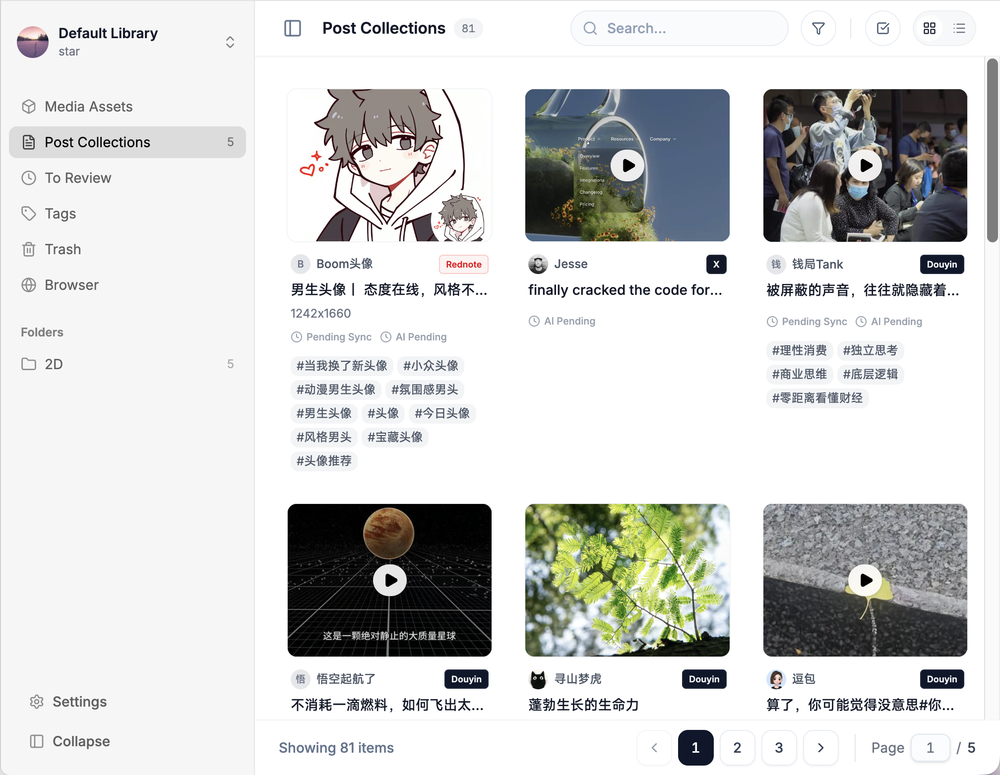
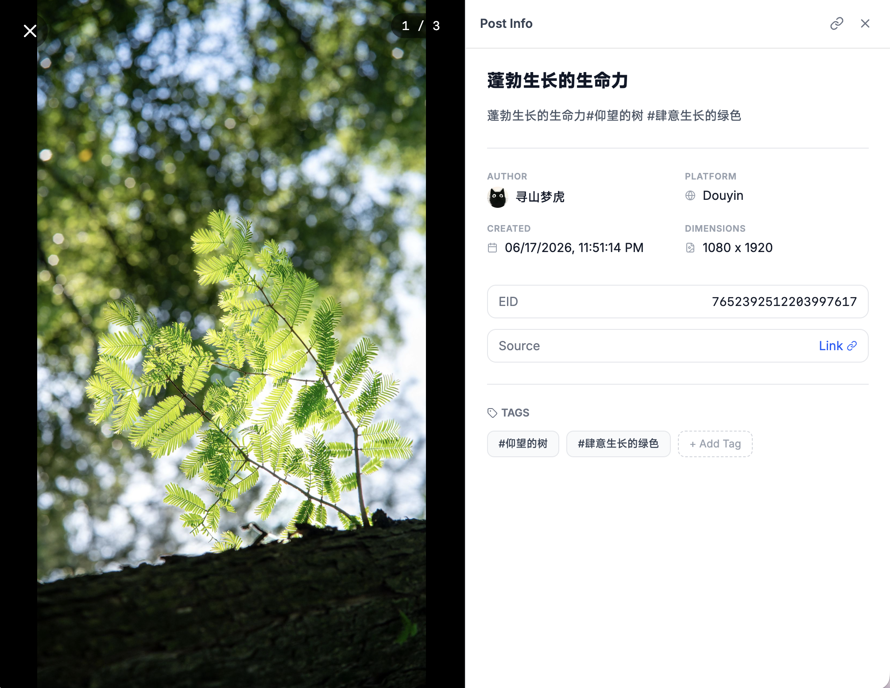

# Stationary

> [简体中文](./docs/README.zh-Hans.md)

Stationary is a multi-platform media asset management and integration platform (MAM) designed for creative professionals and content managers. It functions as a centralized hub and aggregator for social media content (such as X/Twitter, Xiaohongshu, Bilibili, Douyin, TikTok, and Instagram), supporting highly customizable libraries, multi-tenant collaboration, and advanced metadata sync.

---

## 🎨 User Interface & Views

Stationary features a clean, premium desktop-class layout built on Apple-like depth layers (**Card-on-Canvas** design system) and a sleek minimalist aesthetics.

### 1. Board View (Post Board)
The **Board View** displays synced items grouped as logical posts. Each card represents a post containing the author's details, publishing time, title, tags, and a thumbnail of the primary media asset.



### 2. Detail Inspector Drawer
Clicking on any post card slides out the **Detail Panel** from the right. This drawer contains:
* **Interactive Media Carousel**: Powered by Swiper. Renders high-quality images and video players.
* **Metadata Fields**: Quick access to author name, original platform URL, published time, description, and list of tags.



### 3. All Pins View (Media Grid)
Accessible via the sidebar navigation. It lists media items directly, bypassing the post container. It supports two display modes:
* **Flat Mode**: Displays all media items as independent cards. Perfect for searching granular assets.
* **Stacked Mode**: Collapses media files belonging to the same post into a single card (displaying the first media, `sort_order = 0`). A badge (e.g., `+3`) overlay indicates how many additional assets are grouped inside the stack.

---

## 🌟 Interactive Media Capabilities

Stationary natively supports premium playback and rendering formats to handle modern phone camera media:

* **Live Photo Playback**: Live Photo assets are synced with separate static cover tracks and dynamic video tracks. Moving over or long-clicking the photo triggers interactive live playing.
* **HEIC/HEIF Image Rendering**: Directly renders raw Apple HEIC/HEIF images on the browser.
* **Unified DASH Video Streaming**: High-quality videos with split audio/video tracks are reconstructed on-the-fly and streamed via the DASH protocol using `dash.js` and custom `sidx` SegmentBase indexes for instant, low-latency, segment-based buffering.
* **WebVTT Subtitle Conversion**: Subtitles provided in platform-specific formats (such as Bilibili JSON) are automatically parsed and translated to standard WebVTT subtitle files (`.vtt`) during synchronization and served on the player.

---

## 🏷️ Tag & Library Management

### Library Switcher & Multi-Tenancy
* **Libraries** isolate physical media and configurations. You can switch between active libraries using the selector dropdown at the top of the sidebar.
* Supports user-level (`LibraryUserAccess`) and group-level (`LibraryGroupAccess`) sharing with roles: `VIEWER` (read-only), `EDITOR` (write, move, sync), and `ADMIN` (full control).

### Reconstructive Tag Index
* Manage platform-synced and user-created tags inside the settings panel.
* **Normalization & Alias**: Merge duplicate tags by mapping aliases to a single `canonical_tag_id`.
* **Tag Status Control**:
  * `ACTIVE`: Displayed on posts and searchable.
  * `CANDIDATE`: Default state for newly imported scraper tags, awaiting review.
  * `IGNORED`: Blocked from displaying or appearing in search queries.

---

## 🔍 Hybrid Search & AI Enrichment

* **Fuzzy Trigram & Vector Search**: Search uses hybrid rank fusion (RRF) matching classic SQL keyword matches with text semantic vector searches (`text-embedding-004`) and multimodal visual similarity searches (`multimodal-embedding-004`).
* **AI Tagging**: Select items and trigger AI analysis to automatically extract captions, summary tags, object colors, styles, scenes, and OCR text using Gemini Flash.

---

## 🚀 Quick Start

### 1. Install Dependencies
```bash
bun install
```

### 2. Environment Configurations
Create `.env` files in the directories:
* **Backend**: Copy `apps/server/.env.example` to `apps/server/.env` and fill out database connections, S3 credentials, Upstash QStash tokens, and Redis details.
* **Frontend**: Copy `apps/web/.env.example` to `apps/web/.env` and set `NUXT_PUBLIC_API_BASE_URL` (usually `http://localhost:9400`).

### 3. Initialize the Database
In the `apps/server` directory, run migrations:
```bash
cd apps/server
bun run db:migrate
```

### 4. Setup Local Development Tunneling (Important)
Because asynchronous download tasks are orchestrated via Upstash Workflow, the Upstash servers must be able to hit your local server callback URL.
1. Run a tunnel tool like `ngrok` or `cloudflared` pointing to port `9400`:
   ```bash
   ngrok http 9400
   ```
2. Copy the generated URL (e.g. `https://xxxx.ngrok-free.app`).
3. Set this URL as the `UPSTASH_WORKFLOW_URL` in your `apps/server/.env` file.

### 5. Launch Development Servers
From the root directory, start both applications concurrently:
```bash
bun run dev
```

---

## 🛠️ Tech Stack & Workspace

The project is structured as a **Bun Workspace Monorepo**:

* **[apps/server](file:///Users/kazuha/dev/stationary/apps/server)**: Backend API built on Bun, Hono framework, Drizzle ORM (PostgreSQL), and Upstash Workflows.
* **[apps/web](file:///Users/kazuha/dev/stationary/apps/web)**: Frontend SPA/SSR built on Nuxt 4, Vue 3, Pinia, Vue Query, Tailwind CSS v4, Plyr, and Swiper.
* **[docs](file:///Users/kazuha/dev/stationary/docs)**: Architectural specs and contract designs.
  * [System Architecture Specification](file:///Users/kazuha/dev/stationary/docs/system_design.md)
  * [Metadata Sync & API Contracts](file:///Users/kazuha/dev/stationary/docs/external_api.contract.md)
  * [Metadata Ingestion Pipelines](file:///Users/kazuha/dev/stationary/docs/save_metadata_flow.md)
  * [TypeScript Guidelines](file:///Users/kazuha/dev/stationary/docs/code.rule.md)
  * [Architectural Trade-offs](file:///Users/kazuha/dev/stationary/docs/trade-offs.md)
