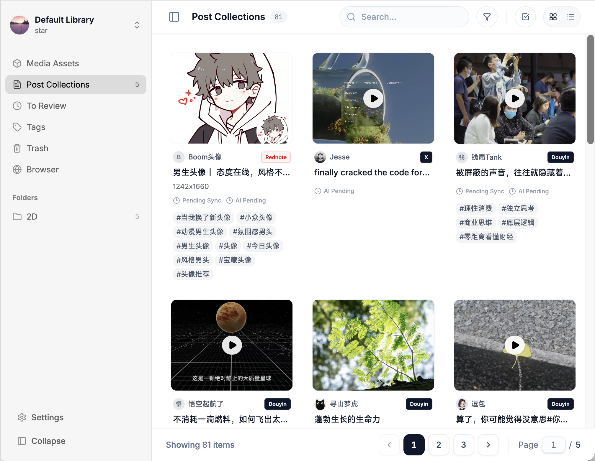
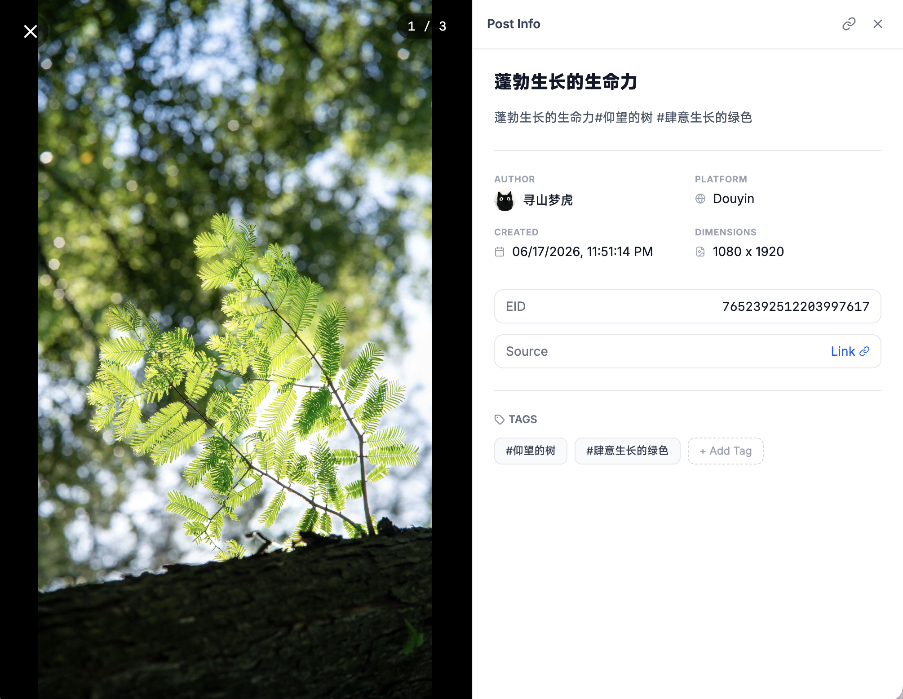

# Stationary (简体中文)

<p align="center">
  
</p>

<h3 align="center">多平台媒体资产管理与集成平台 (MAM)</h3>

<p align="center">
  Stationary 是一款专为创意工作者与内容管理者打造的高性能自建媒体资产管理系统。集内容聚合、元数据同步、交互播放、本地归档与 AI 混合检索于一体，无缝对接各类外部同步 Agent 与平台集成端。
</p>

<p align="center">
  <a href="https://bun.sh"></a>
  <a href="https://nuxt.com"></a>
  <a href="https://hono.dev"></a>
  <a href="https://flutter.dev"></a>
  <a href="https://orm.drizzle.team"></a>
  <a href="https://www.postgresql.org"></a>
</p>

<p align="center">
  <a href="#-核心特性">核心特性</a> •
  <a href="#-用户界面与视图">用户界面</a> •
  <a href="#-技术栈与工作空间">工作空间</a> •
  <a href="#-快速上手">快速上手</a> •
  <a href="#-系统文档">系统文档</a>
</p>

<p align="center">
  <a href="../README.md"><b>English Documentation</b></a>
</p>

---

## ✨ 核心特性

- 🎨 **Card-on-Canvas 美学设计**：融合 Apple 风格的空间卡片画布层级与 Linear 级别的桌面精细度，采用 HSL 色调与高密度布局。
- 📸 **Live Photo 与原生多媒体支持**：原生支持 Live Photo 交互播放、浏览器端 HEIC/HEIF 图像解码，以及 WebVTT 字幕自动转换。
- 🎬 **统一 DASH 分片流播**：针对音视频分离的多轨媒体源，在后台解析 `sidx` 索引块范围并生成 SegmentBase 元数据，通过 `dash.js` 实现免转码、低延迟流播。
- 🏷️ **多租户媒体库与标签管理**：基于 Library 的物理隔离，支持 RBAC 细粒度授权（`VIEWER` / `EDITOR` / `ADMIN`），提供标签别名映射与规范化审核流。
- 🔍 **AI 混合检索与富化**：结合 SQL Trigram 模糊匹配、Gemini 文本向量 (`text-embedding-004`) 与视觉向量 (`multimodal-embedding-004`)，使用倒数排序融合 (RRF) 算法实现精准检索与 AI 标注。
- ⚡ **自研持久化任务引擎**：基于 PostgreSQL 的任务队列引擎，利用 `SKIP LOCKED` 原子租约锁、指数退避重试与 `JobSweeper` 清扫机制，零依赖高可靠运行。

---

## 🎨 用户界面与视图

### 1. Board 视图 (Posts)
以 **Posts** 为基本单元陈列。每张卡片展示作者信息、发布时间、标签以及首张 Media 的缩略图封面。



### 2. 详情抽屉 (Post Inspector)
点击 Post 卡片后从右侧滑出。内置 Swiper 驱动的高清媒体轮播图与完整的 Post 元数据审查面板。



### 3. Media 视图 (All Pins Grid)
越过 Post 容器，直接陈列所有 **Media** 资源（图片/视频），支持两种布局模式：
- **Flat 模式 (平铺)**：所有 Media 独立渲染为卡片，适合精细化物色与搜索特定资产。
- **Stacked 模式 (堆叠)**：将同一 Post 下的多张 Media 折叠展示，仅显示首图及数量角标 (`+N`)。

---

## 🛠️ 技术栈与工作空间

Stationary 采用 **Bun Workspace Monorepo** 架构：

```text
stationary/
├── apps/
│   ├── server/       # Bun + Hono 后端 API 服务，Drizzle ORM，自研 DB 任务队列引擎
│   ├── web/          # Nuxt 4 + Vue 3 桌面端 Web 应用，Tailwind CSS v4，Swiper，Plyr
│   └── flutter/      # Flutter 多端跨平台客户端应用
└── docs/             # 系统设计规范与架构流转文档
```

| 应用/组件 | 技术栈 | 职责与功能 |
| :--- | :--- | :--- |
| **`apps/server`** | Bun, Hono, Drizzle ORM, PostgreSQL, Redis, `@ai-sdk/google` | RESTful API、Better Auth 鉴权、异步任务引擎、S3 资产管理 |
| **`apps/web`** | Nuxt 4, Vue 3, Pinia, Vue Query, Tailwind CSS v4, dash.js | Web 客户端、Card-on-Canvas 布局系统、DASH 播放器、HEIC 渲染 |
| **`apps/flutter`** | Flutter, Dart, Chewie, PhotoView | 移动端与桌面端跨平台客户端 |

---

## 🚀 快速上手

### 前置要求
- **Bun**：`v1.3.0` 或更高版本
- **PostgreSQL**：`v15` 或更高版本（需开启 `pgvector` 与 `pg_trgm` 扩展）
- **Redis**：用于 KV 缓存与接口限流

### 1. 安装依赖
```bash
bun install
```

### 2. 配置环境变量
在对应目录下分别创建 `.env` 文件：
- **后端 (Server)**：复制 `apps/server/.env.example` 为 `apps/server/.env`，填写 PostgreSQL、Redis 和 S3 凭证。
- **前端 (Web)**：复制 `apps/web/.env.example` 为 `apps/web/.env`，设置 `NUXT_PUBLIC_API_BASE_URL`（默认 `http://localhost:9400`）。

### 3. 初始化数据库迁移
```bash
cd apps/server
bun run db:migrate
```

### 4. 启动开发服务器
在根目录下并行启动所有服务：
```bash
bun run dev
```

---

## 📚 系统文档

[`docs/`](./) 目录下包含完整的系统架构与技术设计文档：

- 📐 **[系统设计与数据库规范说明](./system_design.zh-Hans.md)** - 数据模型、软删除与生命周期、JobRunner 任务引擎规范。
- 🔌 **[媒体元数据同步工作流 & API 契约](./external_api.contract.zh-Hans.md)** - 客户端对接规范、`external_id` 生成逻辑与 API 结构。
- 🔄 **[Metadata 物理保存与清理流程详细说明](./save_metadata_flow.zh-Hans.md)** - `saveMetadata` 执行流程、差异检测与 S3 软删除清扫。
- 🔍 **[多空间 AI 混合检索架构规范](./ai_hybrid_search.zh-Hans.md)** - 向量空间隔离、pgvector HNSW 索引与 RRF 排序融合。
- ⚖️ **[系统架构设计取舍与 Trade-offs](./trade-offs.zh-Hans.md)** - Multi-Track 设计、DASH 分片解析与 WebVTT 转换的取舍考量。
- 🛠️ **[任务执行引擎接入指南：新增任务类型](./task_engine_extension.zh-Hans.md)** - 基于策略模式扩展后台异步任务处理器的指南。
- 📜 **[TypeScript 编写规范与避坑指南](./code.rule.zh-Hans.md)** - Temporal API、Web API Streams 和 `bun:File` 强制编码规范。

---

## 📄 许可证

私有项目，保留所有权利。
