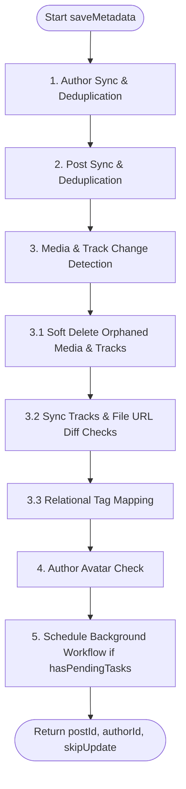

# Metadata Ingestion Pipeline (`saveMetadata`)

> [简体中文](./save_metadata_flow.zh-Hans.md)

This document describes the execution logic and state rules of the `TaskService.saveMetadata` method. As the entrypoint of the synchronization pipeline, this method handles validation, metadata deduplication, change detection, and S3 physical asset soft-delete scheduling before files are actually downloaded.

---

## Workflow Overview

When an external synchronization payload is sent to `/api/task/create`, the backend executes `saveMetadata` for each post **synchronously and atomically**.

By comparing the incoming payload with existing database states, the method determines if it needs to trigger background download tasks (via Upstash QStash/Workflow). If all media URLs and metadata match the database exactly, the method returns `skipUpdate: true`, skipping the background task queue and reducing network overhead.

---

## Detailed Ingestion Steps

### 1. Author Sync & Deduplication
- **Matching**: Queries the `Author` table using the author's platform ID `eid`, `platform`, and the target `library_id`.
- **Insert**: If not found, generates a new author UUID and writes the nickname, platform, signature, and metadata.
- **Update**: If the author exists but the nickname has changed, updates the record in the database. Resets `delete_status = DeleteStatus.ACTIVE` if previously deleted.

### 2. Post Sync & Deduplication
- **Matching**: Queries the `Post` table using `eid` and `source` platform.
- **Exists (Update Path)**:
  - Compares the incoming post details with the database record.
  - Updates the post's title, body description, raw tags array, author reference, and total media counts.
  - Syncs relational tags using `syncEntityTags` (interfacing with the `Tag` and `PostTag` tables).
- **Does Not Exist (Insert Path)**:
  - Inserts a new `Post` record with `sync_status` set to `PENDING` and binds the transaction metadata. Sets `hasPendingTasks = true`.

### 3. Media & Track Change Detection
Iterates over the incoming media array, matching items by `external_id` (or falling back to index order):

#### 3.1 Soft Delete Orphaned Media & Tracks
If a post's media list changes on the source platform (e.g., a photo is deleted from a post):
1. **Identify Orphans**: Finds existing database `Media` items for this post that are missing from the incoming payload.
2. **Soft Delete**: Executes a transaction updating the `delete_status = DeleteStatus.DELETED` and setting `delete_time` on the obsolete `Media`, associated `Track` entries, and the corresponding `File` records. No physical S3 files are deleted at this step.
3. Sets `hasPendingTasks = true`.

#### 3.2 Sync Tracks & File URL Diff Checks
For each active or new media item:
1. **Insert Media**: If not found, inserts a new `Media` row with its status set to `PENDING`.
2. **Track Match**: Compares the incoming tracks (specifying type, purpose, and priority) with existing active `Track` records.
3. **Change Detection**:
   - Checks if any incoming track has a different `source_url`, `is_original` setting, `quality` tier, or modified metadata compared to the database.
   - **On Track URL / Setting Change**:
     1. Marks the old associated `File` record (if any) as `DELETED` and records the `delete_time`.
     2. Sets the `Track` status to `PENDING` and clears out its `file_id` and `last_error`.
     3. Sets `hasPendingTasks = true` to signal that background download and verification are required.
4. **Obsolete Tracks Cleanup**: Any active `Track` records in the database that are missing from the incoming payload are marked as `DELETED`, and their files are marked as `DELETED` to wait for the cron cleanup.

#### 3.3 Relational Tag Mapping
- Calls `syncEntityTags` to parse and sanitize tags.
- For new tags, writes candidate records to the `Tag` table (`status = TagStatus.CANDIDATE`).
- Maintains mappings in the `PostTag` and `MediaTag` tables.

### 4. Author Avatar Check
- Checks if the author has an active avatar. If the payload supplies `avatar_file_url` but `avatar_file_id` is empty, marks the avatar task for download and sets `hasPendingTasks = true`.

### 5. Finalize Ingestion & Response
- If `hasPendingTasks` is `true`:
  - If the post already existed, sets its status to `IN_PROGRESS` and clears previous errors.
  - Returns `{ postId, authorId, skipUpdate: false }` to trigger the QStash background downloader.
- If `hasPendingTasks` is `false`:
  - Returns `{ postId, authorId, skipUpdate: true }`. The caller skips queueing the background downloader, avoiding redundant network queries and API execution cycles.
