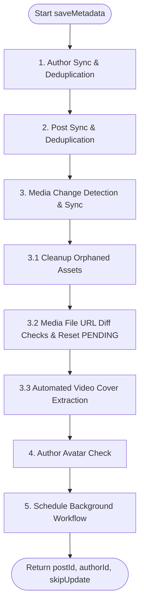

# Metadata Ingestion Pipeline (`saveMetadata`)

> [简体中文](./save_metadata_flow.zh-Hans.md)

This document describes the execution logic and state rules of the `TaskService.saveMetadata` method. As the entrypoint of the synchronization pipeline, this method handles validation, metadata deduplication, change detection, and S3 physical asset cleanup before files are actually downloaded.

---

## Workflow Overview

When an external synchronization payload is sent to `/api/task/create`, the backend executes `saveMetadata` for each post **synchronously and atomically**.

By comparing the incoming payload with existing database states, the method determines if it needs to trigger background download tasks (via Upstash QStash). If all media URLs and metadata match the database exactly, the method returns `skipUpdate: true`, skipping the background task queue and reducing network overhead.

---

## Detailed Ingestion Steps

### 1. Author Sync & Deduplication
- **Matching**: Queries the `Author` table using the author's platform ID `eid` and `platform`.
- **Insert**: If not found, generates a new author UUID and writes the nickname.
- **Update**: If the author exists but the nickname has changed, updates the record in the database.

### 2. Post Sync & Deduplication
- **Matching**: Queries the `Post` table using `eid` and `source`.
- **Deduplication Frequency**: 
  - To prevent redundant API calls, if a sync is requested for a post with the same platform and `eid` within a configurable threshold (default: 1 day), the update is skipped.
  - If requested after the threshold has passed, the backend proceeds with change detection and updates the record.
- **Deduplication Exceptions**: If a post has no `eid` (external ID), it is always treated as a new, unique post, and a new database record is created.
- **Exists (Update Path)**:
  - Detects changes and updates the post's title, body description, tags array, author reference, and total media counts.
  - Detects and handles:
    1. Title/description changes.
    2. Author profile updates (name/avatar).
    3. Media item order changes (e.g., first media moved to the end).
    4. Deletion of existing media.
    5. Media URL or type updates.
  - Links to the specified `library_id` (or falls back to the default library if omitted).
- **Does Not Exist (Insert Path)**:
  - Inserts a new `Post` record with `sync_status` set to `PENDING`.

### 3. Media Change Detection & Sync

This is the core of the ingestion step. It merges incoming media arrays with the database and cleans up obsolete resources.

#### 3.1 Cleanup Orphaned Assets
If a post's media list changes on the source platform (e.g., a photo is deleted from a post):
1. **Identify Orphans**: Finds existing database `Media` items for this post that are missing from the incoming payload.
2. **Physical Cleanup (Trash)**: Fetches all associated `MediaFile` records (e.g., `PRIMARY`, `ALTERNATIVE`, `LIVE_PHOTO_VIDEO`, `COVER`) for these orphaned media items. If they link to physical file records (`file_id` is set), the system calls `moveToTrash` to move the files into a trash folder inside the S3 bucket.
3. **Database Deletion**: Hard deletes the orphaned `Media` and `MediaFile` rows from the database.

#### 3.2 Media File URL Diff Checks
Iterates over the incoming media array, matching items by `external_id` (or falling back to index order):
- **New Media**: Inserts a new `Media` row with its status set to `PENDING`.
- **Existing Media (Change Detection)**:
  - Checks if any of the following URLs have changed:
    - `primary_url` (main media URL)
    - `alternative_url` (alternative URL)
    - `live_photo_url` (Live Photo video track URL)
    - `cover_url` (video cover URL)
  - **On URL Change**:
    1. Calls `moveToTrash` to queue deletion of the obsolete S3 file.
    2. Clears the `file_id` on the `MediaFile` record and resets its status to `PENDING` (clearing out any `last_error`).
    3. Sets `hasPendingTasks = true` to signal that downloads are required.

#### 3.3 Automated Video Cover Extraction (FFmpeg & AVIF)
During background processing, if a video completes downloading but has no valid `COVER` record, it delegates asynchronously to `VideoCoverService`:
1. **Extraction**: The system utilizes `Bun.spawn` to natively invoke `ffmpeg` with SVT-AV1 (`libsvtav1`).
2. **Network & Temp Storage**: FFmpeg streams from a secure, temporary **S3 Presigned GET URL** for the video and writes the AVIF to a seekable temporary file (required by the AVIF muxer to compile ISOBMFF metadata boxes).
3. **Storage Integration**: The AVIF bytes are read into memory (achieving **65% smaller file sizes** compared to JPEG), uploaded to S3 as `.avif`, and the temporary file is guaranteed to be deleted.

### 4. Author Avatar Check
- Checks if the author has an active avatar. If the payload supplies `avatar_file_url` but `avatar_file_id` is empty, marks the avatar task for download and sets `hasPendingTasks = true`.

### 5. Finalize Ingestion & Response
- If `hasPendingTasks` is `true`:
  - Sets the `Post` status to `IN_PROGRESS` and clears previous errors.
  - Returns `{ postId, authorId, skipUpdate: false }`.
- If `hasPendingTasks` is `false`:
  - Returns `{ postId, authorId, skipUpdate: true }`. The caller skips queueing the QStash background downloader, preventing redundant network queries.
