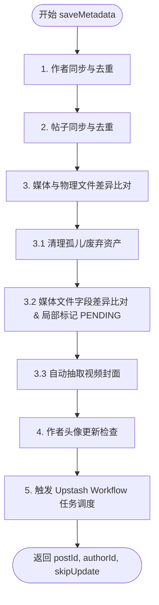

# 元数据保存与同步流水线 (`saveMetadata` - 简体中文)

> [English](./save_metadata_flow.md)

本篇文档详细说明 `TaskService.saveMetadata` 方法的处理逻辑与业务规则。该方法是资产同步的“入口状态机”，主要负责在写入物理文件前，对作者、文章、媒体进行结构化排重（Deduplication）、状态比对以及过期物理文件的清理。

---

## 同步逻辑全局概览

当调用方将包含多篇文章的 Payload 推送至 `/api/task/create` 后，后端会**同步、原子化**地针对每篇文章执行 `saveMetadata`。

该方法通过比对传入的元数据与当前数据库状态，决定是否需要触发后续高消耗的物理文件下载（QStash 异步工作流）。如果没有任何字段或 URL 的改动，则会返回 `skipUpdate: true`，直接绕过后台下载，实现高效防抖。

---

## 详细流转步骤

### 1. 作者同步与去重 (Author Sync)
- **匹配机制**：使用外部作者标识 `eid` 和平台名称 `platform` 联合检索 `Author` 表。
- **插入**：如果库中不存在，则自动创建并分配逻辑 UUID，同时记录作者昵称。
- **更新**：如果作者已存在，但博主更改了昵称（`nickname`），则在数据库中就地更新昵称以保证内容的时效性。

### 2. 帖子同步与去重 (Post Sync)
- **匹配机制**：根据外部文章标识 `eid` 和来源 `source` 检索 `Post` 表。
- **去重频次限制**：
  - 为避免高频重复请求造成性能开销，如果用户在设定阈值时间（默认 1 天，可配置）内多次请求同步同一个平台且 `eid` 相同的帖子，系统将跳过对该帖子的更新。
  - 如果请求时间间隔已超过该阈值，系统则会进入变更检测流程，对内容进行更新。
- **去重特例**：若帖子本身没有 `eid`（外部 ID 缺失），系统将其视为完全独立的全新帖子，不进行去重过滤，直接创建新的数据库记录。
- **已存在 (更新路径)**：
  - 检查并更新帖子的标题、正文描述、标签数组、作者名称及媒体总数。
  - 自动识别并处理以下维度的内容变更：
    1. 帖子标题/正文描述的变动。
    2. 作者名称/头像的更新。
    3. 媒体排序的调整（如首张媒体移动至末尾）。
    4. 删减已存在的媒体。
    5. 媒体 URL 或类型的更新。
  - 重设 `library_id`，若输入参数中未指定 `library_id`，则自动归档至系统默认的 "Default Library"。
- **不存在 (创建路径)**：
  - 插入一条全新的 `Post` 记录，将其 `sync_status` 初始化为 `PENDING`。

### 3. 媒体与物理文件差异比对 (Media Sync)

这是整个流水线最复杂的一步，负责将 incoming 媒体列表与库中已存媒体进行合并，并清除无用的旧文件。

#### 3.1 清理孤儿/废弃资产 (Orphaned Media Deletion)
当帖子内发生内容删减（例如博主删除了原帖中的某张图片）时，服务端需要清理垃圾文件：
1. **识别孤儿**：找到所有已在库中、但不在本次同步 Payload 列表中的 `Media` 记录。
2. **物理文件清理 (Trash)**：针对这些孤儿媒体，依次检索其绑定的 `MediaFile` 记录（包含 `PRIMARY`, `ALTERNATIVE`, `LIVE_PHOTO_VIDEO`, `COVER` 各类角色）。如果这些记录已经绑定了物理文件 ID（`file_id`），则调用存储层 `moveToTrash` 工具，在 S3 桶中将其移入临时垃圾箱目录。
3. **数据库删除**：从库中物理删除这些废弃的 `Media` 和 `MediaFile` 记录。

#### 3.2 媒体文件差异比对 & 局部标记
遍历传入的媒体数组，利用 `external_id` (或 `sort_order` 索引 fallback) 逐个比对：
- **新媒体**：插入 `Media` 记录，初始化其状态为 `PENDING`。
- **已有媒体 (Change Detection)**：
  - 检查以下媒体 URL 是否发生变更：
    - `primary_url` (主媒体链接)
    - `alternative_url` (备用链接)
    - `live_photo_url` (Live Photo 视频链接)
    - `cover_url` (视频封面链接)
  - **URL 变更动作**：如果检测到某项 URL 发生了变化（例如防盗链 Token 更新或原链接失效变动）：
    1. 调用 `moveToTrash` 销毁旧的 S3 物理文件。
    2. 将 `MediaFile` 的 `file_id` 设为 `null`，重置 `sync_status` 为 `PENDING`，清空 `last_error`。
    3. 标记 `hasPendingTasks = true`（通知系统有资产需要重新下载）。

#### 3.3 自动抽取视频封面 (FFmpeg & AVIF)
在后台处理任务中，如果一个视频的主文件 (`PRIMARY`) 已成功下载，但该视频缺乏有效的封面记录 (`COVER`)，则会异步委派给 `VideoCoverService` 处理：
1. **自动提取**：系统将使用 `Bun.spawn` 原生唤起 `ffmpeg` 进程，并采用 SVT-AV1 编码器 (`libsvtav1`)。
2. **网络流式与临时中转**：FFmpeg 将通过安全的、临时的 **S3 预签名 GET 链接**拉取视频流，并由于 AVIF/MP4 容器的元数据重写物理寻址限制，将其写入一个临时中转文件。
3. **入库与存储**：读取该临时文件中的 AVIF 字节流（**比 JPEG 减小了将近 65% 的文件体积**），上传至 S3（后缀为 `.avif`，MIME 为 `image/avif`），并在 `finally` 块中确保临时文件已被彻底物理删除，不留任何磁盘残留。

### 4. 作者头像更新检查
- 检查当前作者是否绑定了头像，如果 Payload 中提供了 `avatar_file_url` 且数据库中 `avatar_file_id` 为空，则标记该作者的头像任务需要处理，`hasPendingTasks` 设为 `true`。

### 5. 状态确认与返回值
- 如果 `hasPendingTasks` 为 `true`，代表存在需要下载的资产：
  - 将 `Post` 的状态更新为 `IN_PROGRESS`，重置 `last_error`。
  - 返回 `{ postId, authorId, skipUpdate: false }`。
- 如果 `hasPendingTasks` 为 `false`，表明所有元数据、图片和视频在库中均为最新版且物理文件完整：
  - 返回 `{ postId, authorId, skipUpdate: true }`，跳过后续的异步 QStash 触发，极大地减少不必要的 HTTP 请求与宽带浪费。
