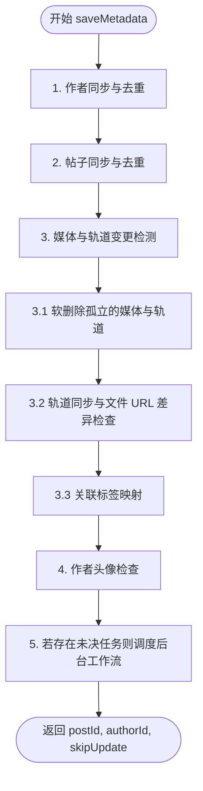

# 媒体元数据同步管道 (`saveMetadata`)

> [English](./save_metadata_flow.md)

本篇文档主要阐述 `TaskService.saveMetadata` 方法的执行逻辑与状态变化规则。作为同步管道的入口点，该方法在文件实际下载之前，负责进行数据校验、元数据去重、变更检测以及 S3 物理资产软删除标记的调度。

---

## 工作流概述

当外部同步负载发送到 `/api/task/create` 时，后端会为每个帖子**同步且原子性地**执行 `saveMetadata`。

通过对比传入的负载与数据库现有的状态，该方法能够确定是否需要触发后台下载任务（通过 Upstash QStash/Workflow 驱动）。如果传入的所有媒体 URL 及元数据与数据库完全一致，该方法将返回 `skipUpdate: true`，从而跳过后台任务队列，减少网络和计算开销。

---

## 详细同步步骤

### 1. 作者同步与去重
- **匹配规则**：在 `Author` 表中根据作者的平台 ID `eid`、平台类型 `platform` 以及目标媒体库 `library_id` 进行查询。
- **插入**：若未找到，生成全新的作者 UUID，并写入昵称、平台、签名及元数据。
- **更新**：若作者已存在且昵称等信息发生变化，更新数据库记录。若该作者之前已被标记删除，重置 `delete_status = DeleteStatus.ACTIVE` 且清除删除时间。

### 2. 帖子同步与去重
- **匹配规则**：在 `Post` 表中根据 `eid` 与源平台 `source` 进行查询。
- **已存在（更新路径）**：
  - 将传入的帖子详情与数据库中现有记录进行比对。
  - 更新帖子的标题、正文描述、原始标签数组、作者关联引用以及媒体总数。
  - 调用 `syncEntityTags` 方法同步与 `Tag` 及 `PostTag` 表的关联映射。
- **不存在（插入路径）**：
  - 插入一条全新的 `Post` 记录，将 `sync_status` 设为 `PENDING`，写入对应的事务元数据，并将 `hasPendingTasks` 设为 `true`。

### 3. 媒体与轨道变更检测
循环传入的媒体数组，通过 `external_id`（若无则退化为数组索引顺序）进行匹配：

#### 3.1 软删除孤立的媒体与轨道
若帖子的媒体列表在源平台发生改变（例如，博主在发布后删除了帖子中的某张图片）：
1. **识别孤立资产**：查询当前帖子在数据库中已存在但缺失于新传入负载中的 `Media` 记录。
2. **软删除标记**：在一个事务中，将这些孤立的 `Media` 记录、关联的 `Track` 记录以及对应的 `File` 记录的 `delete_status` 统一更新为 `DeleteStatus.DELETED`，并标记 `delete_time`。在此步骤中，绝对不物理删除 S3 文件。
3. 将 `hasPendingTasks` 设为 `true`。

#### 3.2 轨道同步与文件 URL 差异检查
针对每个仍保留或新传入的媒体项：
1. **插入媒体**：若当前媒体在库中不存在，插入新的 `Media` 行，初始状态设为 `PENDING`。
2. **轨道比对**：将传入的轨道（包含类型、用途和优先级）与现有 active 状态的 `Track` 记录进行匹配。
3. **变更检测**：
   - 检查传入轨道与数据库记录中的 `source_url`、`is_original` 标记、`quality` 档位或元数据是否发生变更。
   - **若轨道 URL 或配置发生变化**：
     1. 将该轨道之前绑定的物理 `File` 记录标记为 `DELETED`，并写入 `delete_time`。
     2. 将 `Track` 的 `sync_status` 重置为 `PENDING`，同时将 `file_id` 和 `last_error` 设为 null。
     3. 将 `hasPendingTasks` 设为 `true`，以确保触发后台下载与校验。
4. **清理过期轨道**：传入负载中已不存在的 active 状态 `Track` 变体会被标记为 `DELETED`，其关联物理 `File` 也会被同步软删除以等待定时任务清理。

#### 3.3 关联标签映射
- 调用 `syncEntityTags` 对标签进行清洗与去重。
- 对于库中未记录的新标签，往 `Tag` 表中写入状态为 `TagStatus.CANDIDATE`（候选标签）的记录，待后续管理员审核。
- 维护 `PostTag` 与 `MediaTag` 关联映射表的记录。

### 4. 作者头像检查
- 检查作者当前是否拥有激活的头像。若传入负载提供了 `avatar_file_url` 且数据库中 `avatar_file_id` 为空，则标记头像任务为未决状态，设置 `hasPendingTasks = true`。

### 5. 同步完成与响应
- 若 `hasPendingTasks` 为 `true`：
  - 如果帖子已经存在，则将其状态更新为 `IN_PROGRESS`，清除历史错误。
  - 返回 `{ postId, authorId, skipUpdate: false }`，触发 QStash 后台工作流。
- 若 `hasPendingTasks` 为 `false`：
  - 直接返回 `{ postId, authorId, skipUpdate: true }`。调用端收到后会跳过向 QStash 队列投递任务，避免冗余的网络调用和 API 损耗。
