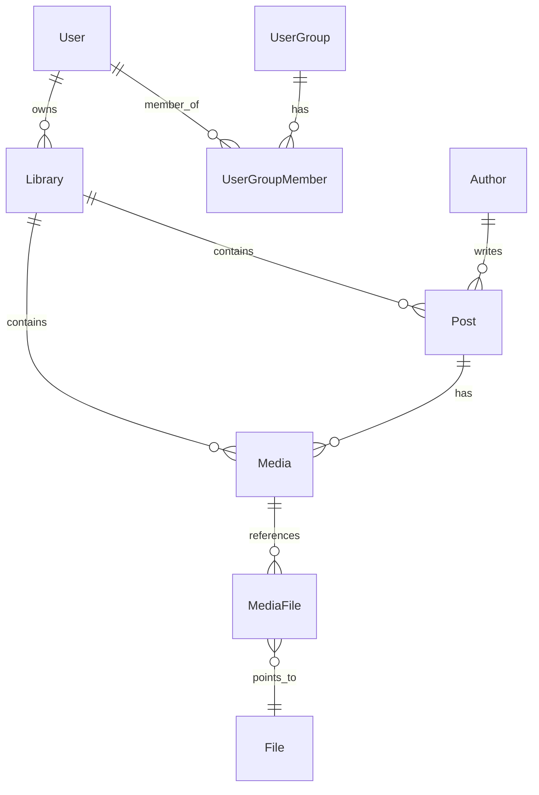

# System Design & Database Specifications

> [简体中文](./system_design.zh-Hans.md)

This document details the business domain relationships, database design guidelines, dual-view UI rendering mechanisms, and multitenant permission layouts used in Stationary.

---

## 1. Database Design Guidelines

To guarantee high-throughput, low-latency, and horizontal scalability during concurrent sync pipelines, all tables follow these architectural database rules:

### 1.1 snake_case Naming
- All table names and column names must strictly follow **`snake_case`**. For example: `avatar_file_id`, `create_time`, and `sort_order`.
- *Note*: Tables created natively by Better Auth (e.g., `better_user`, `better_session`) follow Better Auth's default formatting, but all custom business fields and new tables must use `snake_case`.

### 1.2 Foreign-Key-Free Design (No Physical FKs)
- **Rule**: Do not declare physical foreign key constraints (`.references()`) in Drizzle schema definitions.
- **Why**: Physical foreign keys can trigger lock contention and cascade blocks under high-concurrency writes and make database partitioning or horizontal scaling difficult.
- **Implementation**: Relationships are treated as **logical associations** handled entirely in the application layer. These relations are declared via Drizzle's `defineRelations` in `relations.ts` to allow type safety and relational `with` queries at the API layer.

---

## 2. Core Model Relationships

The schema is divided into three layers: **Content layer**, **Physical asset layer**, and **Multitenant layout**.

### 2.1 Content Layer
- **Author**: Platform-wide unique profile (using the compound index of `eid` + `platform`). Stores name, handles, and a reference to their avatar file (`avatar_file_id`).
- **Post**: Belongs to a specific `Library`. Functions as the container for posts synced from social sites, keeping records of platform `eid`, titles, tags, and publishing dates.
- **Media**: Belongs to a specific `Post` or floats as an independent file (where `post_id` is null). Stores titles, description, sorting positions (`sort_order`), and type (IMAGE, VIDEO, LIVE_PHOTO).

### 2.2 Asset & Storage Layer (`MediaFile` & `File`)
- **File**: Points to physical file locations on S3. Uses `s3_key` as the primary key/unique identifier. Tracks file hashes, size, dimensions, and video durations to prevent duplicate downloads.
- **MediaFile**: Connects `Media` to physical `File` records, assigning file roles within a media item:
  - `PRIMARY`: Main asset (the image or video file).
  - `ALTERNATIVE`: Backup or fallback files.
  - `LIVE_PHOTO_VIDEO`: The short video track associated with a Live Photo.
  - `COVER`: The cover frame of a video.
- [Future] **Reference Counting & Sharing Rule**: When multiple entities reference the same physical `File`, do not use a simple counter column (`ref_count`) on the `File` table. Instead, use a dedicated reference table (e.g., `file_usage`) to track active references dynamically. (Since there are no multi-reference relationships yet, the implementation of the `file_usage` table can be deferred.)

---

## 3. Lifecycle & Deletion Policies

When database foreign keys are disabled, the application layer must enforce referential integrity and handle deletes explicitly.

### 3.1 Recycle Bin Semantics (Soft vs. Hard Delete)
To prevent accidental data loss, the deletion flow is split into two phases:
- **Move to Recycle Bin (Soft Delete)**: The initial delete of a `Post` or `Media` marks the record as deleted by setting `delete_time`. Mapping records in `post_tag`, `media_tag`, and `media_file` are preserved, and S3 physical files are kept in place. The item in the Recycle Bin still counts as an active file reference.
- **Purge Recycle Bin (Hard Delete / Purge)**: Occurs when the user purges the Recycle Bin or executes a permanent delete. This physically deletes the join table records (`post_tag`, `media_tag`, `media_file`) and the database entity rows (`Post` or `Media`).
  - *Reference Counting Cleanup*: We gather candidate `file_id`s from deleted `media_file` records, check the `file_usage` table to verify if any other active entity references them (Since there are no multi-reference relationships yet, reference counting check is not required for now). **Only if the physical file has no remaining active references** does the backend trigger physical S3 object deletion and remove the file record from the `File` table.

### 3.2 Library Deletion Policy
To prevent accidental deletion, non-empty libraries (`Library`) do not support direct deletes.
- **Pre-deletion Check**: Before deleting a `Library` record, the system verifies that there are no `Post` or `Media` items belonging to it, including recycled ones.
- **Validation**: The deletion is rejected if any content remains under the library. The library can only be deleted when completely empty.

---

## 4. Dual-View UI Mechanism

The user interface supports two primary data viewing flows:

### 4.1 Board View (Post List)
- Focuses on the `Post` unit. Every card renders a Post item, using the media item with `sort_order = 0` as the card's thumbnail cover.
- Displays author info, post titles, tags, and local publishing times.

### 4.2 All Pins View (Media List)
- Focuses on the individual `Media` file. Users can browse images and videos directly. Two display modes are supported:

| Display Mode | SQL Filter Logic | Rendering Output |
| :--- | :--- | :--- |
| **Flat Mode** | No special filter (lists all `Media` items) | Renders every image and video as an independent card. Ideal for granular asset search. |
| **Stacked Mode** | `or(isNull(Media.post_id), eq(Media.sort_order, 0))` | Folds media assets belonging to the same post. Shows only independent files and the **first media (`sort_order = 0`)** of posts, displaying an overlay badge (e.g., `+5`) indicating other assets are grouped under it. |

---

## 5. Multitenancy & Sharing (User Group & Library)

The system supports group collaboration using fine-grained permissions:

### 5.1 Resource Entity
- **Library**: The physical isolation boundary for assets. All posts and media files must specify their parent `library_id` on creation.

### 5.2 Group Sharing & Access Control
- Users can create their own `Library` instances and build `UserGroup` teams.
- Library shares can be configured via two tables:
  1. **User-level sharing (`LibraryUserAccess`)**: Grants specific view or edit access to a single `User`.
  2. **Group-level sharing (`LibraryGroupAccess`)**: Grants access to all members of a `UserGroup`.
- **Access Roles**:
  - `VIEWER`: Read-only access to browse and retrieve assets.
  - `EDITOR`: Read and write access to upload, move, or edit posts and media.
  - `ADMIN`: Full administrative control, including library deletion and permission management.
