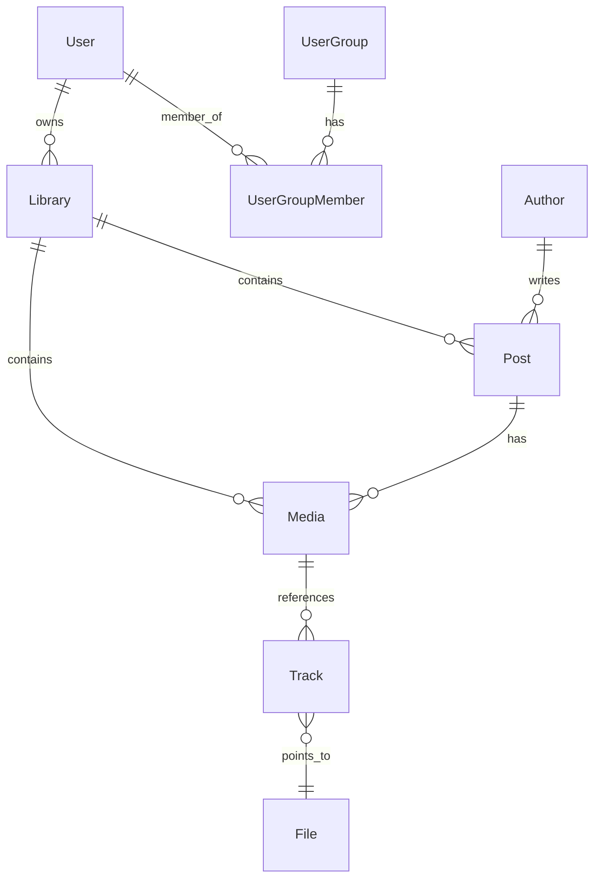
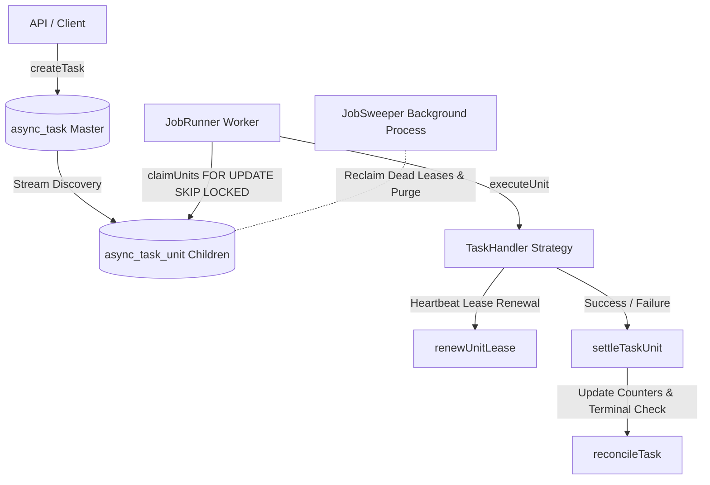

# System Design & Database Specifications

> [简体中文](./system_design.zh-Hans.md)

This document details the business domain relationships, database design guidelines, dual-view UI rendering mechanisms, and multitenant permission layouts used in Stationary.

---

## 1. Database Design Guidelines

To guarantee high-throughput, low-latency, and horizontal scalability during concurrent sync pipelines, all tables follow these architectural database rules:

### 1.1 snake_case Naming
- All table names and column names must strictly follow **`snake_case`**. For example: `avatar_file_id`, `create_time`, and `sort_order`.
- *Note*: Tables created natively by Better Auth (e.g., `better_user`, `better_session`) follow Better Auth's default formatting, but all custom business fields and new tables must use `snake_case`.

### 1.2 Foreign-Key-Free Design (No Physical FKs)
- **Rule**: Do not declare physical foreign key constraints (`.references()`) in Drizzle schema definitions.
- **Why**: Physical foreign keys can trigger lock contention and cascade blocks under high-concurrency writes and make database partitioning or horizontal scaling difficult.
- **Implementation**: Relationships are treated as **logical associations** handled entirely in the application layer. These relations are declared via Drizzle's `defineRelations` in `relations.ts` to allow type safety and relational `with` queries at the API layer.

---

## 2. Core Model Relationships

The schema is divided into three layers: **Content layer**, **Physical asset layer**, and **Multitenant layout**.

```mermaid
erDiagram
    User ||--o{ Library : "owns"
    User ||--o{ UserGroupMember : "member_of"
    UserGroup ||--o{ UserGroupMember : "has"
    Library ||--o{ Post : "contains"
    Library ||--o{ Media : "contains"
    Author ||--o{ Post : "writes"
    Post ||--o{ Media : "has"
    Media ||--o{ Track : "references"
    Track }o--|| File : "points_to"
```

### 2.1 Content Layer
- **Author**: Platform-wide unique profile (using the compound index of `library_id` + `platform` + `eid`). Stores nickname, signature, platform, and a reference to their avatar file (`avatar_file_id`).
- **Post**: Belongs to a specific `Library`. Functions as the container for posts synced from social sites, keeping records of platform `eid`, titles, description, tags, and original publishing date (`published_time`).
- **Media**: Belongs to a specific `Post` or floats as an independent file (where `post_id` is null). Stores titles, description, sorting positions (`sort_order`), and type (IMAGE, VIDEO, LIVE_PHOTO, AUDIO, PDF).

### 2.2 Asset & Storage Layer (`Track` & `File`)
- **File**: Points to physical file locations on S3. Uses a UUID as primary key, tracking the file SHA-256 `hash` for deduplication, as well as `size`, `path` (S3 key), `bucket`, dimensions (`width`, `height`), and video `duration`.
- **Track**: Connects a `Media` item to its physical `File` records, assigning file roles and formats within that media item. A single logical `Media` item can contain multiple `Track` variants:
  - `type` (TrackType Enum): `IMAGE`, `VIDEO`, `AUDIO`, `SUBTITLE`.
  - `purpose` (TrackPurpose Enum):
    - `CONTENT`: Main asset (the image, video, audio track).
    - `COVER`: The cover frame of a video or static display.
    - `THUMBNAIL`: Extracted small preview image.
    - `PREVIEW`: Low-resolution video or web preview.
  - `quality` (TrackQuality Enum): `ORIGINAL`, `HIGH`, `MEDIUM`, `LOW`.
  - `priority` & `source_url`: Used to download, match, and choose priority streams during synchronization.
- **Reference Counting & Sharing Rule**: When multiple entities reference the same physical `File`, do not use a simple counter column (`ref_count`) on the `File` table. Instead, use `DeleteService.canPurgeFile` to run reference queries dynamically across the tables (`Author` avatar, `Library` cover, and `Track` file references).

---

## 3. Lifecycle & Deletion Policies

When database foreign keys are disabled, the application layer must enforce referential integrity and handle deletes explicitly.

### 3.1 Recycle Bin Semantics (Soft vs. Hard Delete)
To prevent accidental data loss and guarantee file consistency, the deletion flow is split into two phases:
- **Move to Recycle Bin (Soft Delete)**: The initial delete of a `Post` or `Media` marks the record as deleted by setting `delete_status = DeleteStatus.DELETED` and setting `delete_time`. Associated rows (`Track`, `File`) are also updated to the `DELETED` status, but the physical files in S3 are kept in place.
- **Purge Recycle Bin (Hard Delete / Purge via Cron)**:
  1. A scheduled cron job `/purge-expired-files` runs every day to fetch `File` records that have been in the `DELETED` status for more than 30 days.
  2. For each candidate file, the background worker invokes `DeleteService.canPurgeFile(fileId)` to query if there are any remaining active references in `Author` avatars, `Library` covers, or active `Track` records.
  3. **Only if there are no remaining active references** does the backend trigger physical S3 object deletion (`s3.delete`) and permanently hard delete the `File` row from the database.
  4. This soft-deletion state machine guarantees S3 and DB consistency, ensuring no active links are broken and orphans are swept cleanly.

### 3.2 Library Deletion Policy
To prevent accidental deletion, non-empty libraries (`Library`) do not support direct deletes.
- **Pre-deletion Check**: Before deleting a `Library` record, the system verifies that there are no `Post` or `Media` items belonging to it, including recycled ones.
- **Validation**: The deletion is rejected if any content remains under the library. The library can only be deleted when completely empty.

---

## 4. Dual-View UI Mechanism

The user interface supports two primary data viewing flows:

### 4.1 Board View (Post List)
- Focuses on the `Post` unit. Every card renders a Post item, using the media item with `sort_order = 0` as the card's thumbnail cover.
- Displays author info, post titles, tags, and local publishing times.

### 4.2 All Pins View (Media List)
- Focuses on the individual `Media` file. Users can browse images and videos directly. Two display modes are supported:

| Display Mode | SQL Filter Logic | Rendering Output |
| :--- | :--- | :--- |
| **Flat Mode** | No special filter (lists all `Media` items) | Renders every image and video as an independent card. Ideal for granular asset search. |
| **Stacked Mode** | `or(isNull(Media.post_id), eq(Media.sort_order, 0))` | Folds media assets belonging to the same post. Shows only independent files and the **first media (`sort_order = 0`)** of posts, displaying an overlay badge (e.g., `+5`) indicating other assets are grouped under it. |

---

## 5. Multitenancy & Sharing (User Group & Library)

The system supports group collaboration using fine-grained permissions:

### 5.1 Resource Entity
- **Library**: The physical isolation boundary for assets. All posts and media files must specify their parent `library_id` on creation.

### 5.2 Group Sharing & Access Control
- Users can create their own `Library` instances and build `UserGroup` teams.
- Library shares can be configured via two tables:
  1. **User-level sharing (`LibraryUserAccess`)**: Grants specific view or edit access to a single `User`.
  2. **Group-level sharing (`LibraryGroupAccess`)**: Grants access to all members of a `UserGroup`.
- **Access Roles**:
  - `VIEWER`: Read-only access to browse and retrieve assets.
  - `EDITOR`: Read and write access to upload, move, or edit posts and media.
  - `ADMIN`: Full administrative control, including library deletion and permission management.

---

## 6. Task Queue Engine & JobRunner Architecture

Stationary implements an **in-house, PostgreSQL-backed asynchronous task queue** and in-process `JobRunner`, eliminating external message broker dependencies (e.g., Redis/BullMQ). Task state, chunked discovery, lease locking, exponential backoff retries, and progress reconciliation are managed directly within PostgreSQL.

```mermaid
flowchart TD
    A[API / Client] -->|createTask| B[(async_task Master)]
    B -->|Stream Discovery| C[(async_task_unit Children)]
    D[JobRunner Worker] -->|claimUnits FOR UPDATE SKIP LOCKED| C
    D -->|executeUnit| E[TaskHandler Strategy]
    E -->|Heartbeat Lease Renewal| F[renewUnitLease]
    E -->|Success / Failure| G[settleTaskUnit]
    G -->|Update Counters & Terminal Check| H[reconcileTask]
    I[JobSweeper Background Process] -.-|Reclaim Dead Leases & Purge| C
```

### 6.1 Master-Child Data Model

- **`AsyncTask` (Master Table)**: Represents high-level asynchronous operations (`COVER_RECONCILE`, `COVER_BATCH`, `AI_ENRICH`, `POST_PROCESS`, `AVATAR_COPY`). Tracks stream discovery state (`discovery_cursor`, `discovery_complete`), user control signals (`PAUSE`, `CANCEL`), concurrency limit (`max_in_flight`), and atomic counters (`succeeded_units`, `failed_units`, `cancelled_units`).
- **`AsyncTaskUnit` (Child Table)**: Represents atomic execution units scoped to a master task (e.g., generating a `COVER_DERIVATIVE` thumbnail or calling AI for a single media item). Maintains entity references (`subject_type`, `subject_id`), idempotent key (`unit_key`), execution status (`PENDING`, `RUNNING`, `SUCCEEDED`, `FAILED`, `CANCELLED`), lease token (`lease_token`), and lease expiry timestamp (`lease_expires_at`).

### 6.2 Execution Lifecycle & Safety

1. **Chunked Stream Discovery**: Master tasks scan candidate items incrementally using cursor payloads (`discoverTaskBatch`), preventing massive query memory overhead.
2. **Atomic Lease Locking & Claiming**: `JobRunner` retrieves eligible `PENDING` units using PostgreSQL `FOR UPDATE SKIP LOCKED` (`claimUnits`), acquiring a 60-second execution lease (`lease_token`).
3. **Heartbeat Lease Renewal**: During execution (`executeUnit`), a 20-second background heartbeat interval continuously extends active leases (`renewUnitLease`). Loss of lease or parent task cancellation aborts execution via `AbortController`.
4. **Exponential Backoff Retries**: Failed units with retry eligibility recalculate next availability (`available_at`) using jittered exponential backoff:
   $$\text{Delay} = \min\left(300, 5 \times 2^{\text{attempt}-1} \times \text{jitter}\right) \text{ seconds}$$
5. **Reconciliation & Finalization**: Upon unit completion, progress counters update atomically. Once all units finish and `discovery_complete = true`, the master task auto-converges to `COMPLETED` or `FAILED` and invokes `finalizeTask`.
6. **Multi-Node Real-Time Wake & Fallback (Redis Pub/Sub)**: When new jobs are enqueued, resumed, or discovered, a lightweight broadcast signal is published via Redis Pub/Sub (`jobs:wake_channel`), instantly triggering `JobRunner.wake()` across all worker instances in a horizontally scaled cluster. To guarantee absolute execution reliability, `JobRunner` maintains a 5-second periodic polling fallback (`setInterval`) alongside `JobSweeper` background audits, ensuring jobs are picked up within 5 seconds even if Redis connectivity fails or messages are missed.

### 6.3 Recovery & Maintenance (`JobSweeper`)

An automated background sweeper (`JobSweeper`) runs every 30 seconds to handle edge cases:
- **`reclaimExpiredLeases`**: Recovers abandoned `RUNNING` units from crashed workers.
- **`recoverInterruptedDiscovery`**: Resumes interrupted stream discovery scans following server restarts.
- **`reconcileReadyTasks`**: Audits and aligns state for completed task units.
- **`purgeOldTasks`**: Hard purges terminal task records older than 7 days to prevent database bloat.

### 6.4 Cover Generation & Reconciliation Specification

Cover generation, updating, and reconciliation workflows are governed by `CoverJobHandler` and `CoverService` following these specification rules:

1. **Manual Re-generation & Same-Quality Overwrite**:
   - Manually triggering cover generation for an existing quality (e.g. `LOW` + `MEDIUM`) re-renders the cover frame from source media and uploads the output AVIF to S3, **overwriting the existing S3 key**.
   - Database `File` metadata (size, dimensions, update time) and `Track` records (`file_id`, `update_time`, `sync_status = COMPLETED`) are updated synchronously.
2. **Coexistence of Un-targeted Qualities**:
   - If a media item already possesses `LOW` + `MEDIUM` + `HIGH` cover tracks and a task dispatches only `LOW` + `MEDIUM`, only `LOW` and `MEDIUM` covers are rendered and updated.
   - The existing `HIGH` cover `Track` and S3 file remain **fully active** (`ACTIVE` state) and are not pruned or mutated.
3. **`COVER_RECONCILE` Rules**:
   - **Incremental Reconciliation**: Reconciliation tasks only ensure that media items possess cover tracks matching the currently configured library qualities (`library.cover_qualities`).
   - **No Pruning on Configuration Reduction**: Reducing library cover quality config from `[LOW, MEDIUM, HIGH]` to `[LOW, MEDIUM]` will **never delete** existing `HIGH` cover tracks or S3 files.
   - **Skip Re-rendering on Config Restoration**: Restoring configuration back to `[LOW, MEDIUM, HIGH]` and running `COVER_RECONCILE` recognizes existing `HIGH` cover tracks whose source file is unchanged, automatically setting `isAlreadyCompleted = true` to skip redundant rendering.

