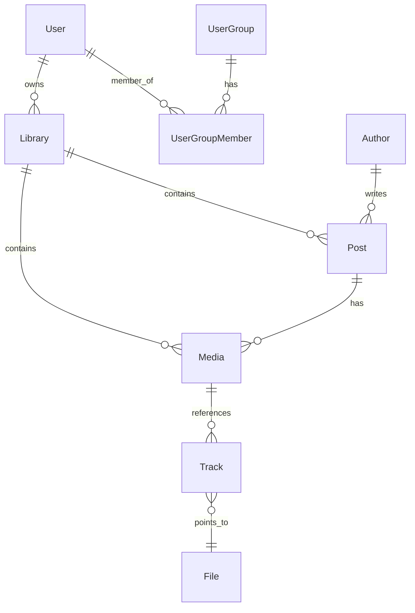

# 系统设计与数据库规范 (简体中文)

> [English](./system_design.md)

本篇文档主要阐述 Stationary 平台的业务模块关系、核心数据库设计原则、双轨制展示机制以及多租户权限隔离方案。

---

## 1. 数据库设计原则

为保证系统在高并发、海量资产导入与同步时的吞吐能力与横向扩展能力，项目在数据库层面遵循以下核心设计规范：

### 1.1 命名规范 (Snake Case)
- 数据库的所有表名、字段名必须**严格使用 `snake_case` (下划线命名法)**。例如：`avatar_file_id`, `create_time`, `sort_order`。
- 注：Better Auth 生成的底层系统表（如 `better_user`, `better_session`）由于依赖库底层映射，保留其默认命名格式，但业务拓展字段及所有新业务表必须遵守 `snake_case`。

### 1.2 无物理外键设计 (No Explicit Foreign Keys)
- **硬性要求**：在 Drizzle ORM 定义中，绝对不允许在列上声明物理外键 `.references()`（除注释说明外）。
- **设计 Rationale**：物理外键在分布式或大规模水平扩容时会造成严重的锁竞争与级联操作负担。
- **关联处理**：所有实体关联关系均为**逻辑关联**。关联的维护和业务完整性由应用层逻辑负责，并通过 Drizzle 的 `relations`（在 `relations.ts` 中通过 `defineRelations`）进行声明，以便在 API 层进行便捷的类型推导与 `with` 关联查询。

---

## 2. 核心数据模型关系

Stationary 的底层数据模型主要分为**内容层**、**资产层**、**用户与隔离层**。

### 2.1 内容层关系
- **Author (作者)**：跨平台唯一（通过 `library_id` + `platform` + `eid` 联合唯一）。保存多平台博主的昵称、签名、平台及头像文件引用（`avatar_file_id`）。
- **Post (帖子/文章)**：属于某一个 `Library`（媒体库）。是内容的逻辑载体，记录源站的 `eid`、标题、描述、标签及原始发布时间 (`published_time`)。
- **Media (媒体逻辑实体)**：隶属于某个 `Post`，或作为独立媒体（`post_id` 为 null）。包含排序、标题、描述、媒体类型（IMAGE, VIDEO, LIVE_PHOTO, AUDIO, PDF）以及各类原始下载 URL。

### 2.2 资产与物理存储层 (Track & File)
- **File (物理资产表)**：对应 S3 中的真实文件。以 UUID 为主键，记录防重下载的 SHA-256 `hash`，以及文件大小 `size`、S3 存储路径 `path`、存储桶 `bucket`、图片/视频尺寸 (`width`, `height`) 和视频时长 `duration`。
- **Track (媒体轨道表)**：作为 `Media` 与 `File` 之间的桥梁，表明一个物理文件在当前媒体中扮演的角色和格式。单个逻辑 `Media` 可以包含多个 `Track` 变体：
  - `type` (TrackType 轨道类型)：`IMAGE` (图片)、`VIDEO` (视频)、`AUDIO` (音频)、`SUBTITLE` (字幕)。
  - `purpose` (TrackPurpose 轨道用途)：
    - `CONTENT`：主轨道（如主视频轨、音频轨或原图）。
    - `COVER`：封面图（如视频对应的封面图）。
    - `THUMBNAIL`：提取的较小网格缩略图。
    - `PREVIEW`：低码率的预览流。
  - `quality` (TrackQuality 轨道画质)：`ORIGINAL`, `HIGH`, `MEDIUM`, `LOW`。
  - `priority` (优先级) 与 `source_url` (原始同步 URL)：后台同步下载时用于确定变体解析和流媒体选择的策略。
- **引用审计规则**：当多个实体引用同一个物理 `File` 时，系统不使用静态的 `ref_count` 字段，而是通过 `DeleteService.canPurgeFile` 对 `Author` 头像、`Library` 封面和 active `Track` 记录进行动态联表计数查询。

---

## 3. 生命周期与删除策略 (Lifecycle & Deletion Policies)

在无物理外键的数据库架构下，应用层必须显式维护引用完整性并规范删除流程。

### 3.1 回收站语义 (软删除与硬删除)
为提供数据可恢复性并保证物理资产的一致性，删除流程分为两阶段：
- **进入回收站 (软删除)**：`Post` 或 `Media` 的首次删除操作被定义为“软删除”。在表中将 `delete_status` 设置为 `DeleteStatus.DELETED`，并标记 `delete_time` 时间戳。对应的 `Track` 和 `File` 记录也会同步设为 `DELETED`，此时保留 S3 物理对象不作任何删改。
- **清空回收站 (异步硬删除/Purge via Cron)**：
  1. 系统后台配置了一个定时任务 `/purge-expired-files`（例如每日运行）。
  2. 该任务检索已被标记为 `DELETED` 且超过 30 天的 `File` 记录。
  3. 针对每个待清理的 `File`，执行 `DeleteService.canPurgeFile(fileId)` 动态审计。
  4. **只有当该物理文件完全没有任何其他实体引用时**，才调用 S3 API 物理删除存储对象 (`s3.delete`)，并在数据库中彻底 `DELETE` 该 `File` 记录。
  5. 这种软删除状态机确保了 S3 物理资源与 DB 逻辑数据的高度一致，避免了 API 响应阻塞和悬挂引用的发生。

### 3.2 资源库删除策略
为了防止意外删除，非空的媒体库（Library）不支持直接删除。
- **删除前置检查**：在尝试删除某个资源库 `Library` 之前，系统必须检查该库下是否存在任何 `Post` 或 `Media`，包括回收站中的记录。
- **判定规则**：只要库下仍存留任何内容，系统将拒绝删除请求并提示用户先清空资源库及其回收站。只有在内容完全清空后，才允许删除 `Library` 记录本身。

---

## 4. 双轨制展示机制 (Dual-View System)

在交互层面，平台提供以下两套主要视图：

### 4.1 看板视图 (Board View / Post List)
- 展示是以 `Post` 为主体的流。每个 Card 对应一篇帖子，卡片封面上展示该帖子下 `sort_order` 为 0 的 `Media` 缩略图。
- 能够显示作者信息、帖子标题、发布时间与帖子包含的媒体总数。

### 4.2 资产视图 (All Pins / Media List)
资产视图允许用户越过 Post 维度，直接在图片/视频层面进行铺展。在此视图下支持**两种布局切换**：

| 布局模式 | 业务筛选逻辑 (SQL Filter) | 展现效果 |
| :--- | :--- | :--- |
| **平铺模式 (Flat)** | 无特殊限制，查询并排列所有 `Media` 记录 | 每一个独立的图片或视频都作为一个单独的 Card 渲染，用户可以高频检索细节资产。 |
| **堆叠模式 (Stacked)** | `or(isNull(Media.post_id), eq(Media.sort_order, 0))` | 将属于同一帖子的多张媒体卡片“折叠”起来。只显示无 Post 的独立媒体，以及每个帖子中的**首个媒体（`sort_order` 为 0）**。卡片上会显示角标（如 `+5`）提示该合辑下还有其他多张图片。 |

---

## 5. 多租户隔离与共享机制 (User Group & Library)

为支持多用户团队协作，系统引入了多级权限控制：

### 5.1 访问资源实体
- **Library (媒体库)**：资产的物理隔离单位。每一个 Post 和 Media（如果关联）在创建时都必须指定所属的 `library_id`。

### 5.2 协作与权限
- 用户拥有独立的 `Library` 实例，亦可建立 `UserGroup` (用户组)。
- 系统支持两个维度的分享授权：
  1. **用户级别分享 (`LibraryUserAccess`)**：将 Library 的查看/编辑权限赋予特定 `User`。
  2. **用户组级别分享 (`LibraryGroupAccess`)**：将 Library 授权给整个 `UserGroup`（组内成员拥有 `LibraryGroupAccess` 定义的相应权限）。
- **权限角色 (AccessRole)**：
  - `VIEWER`：只读权限，可以浏览、搜索和检索资产。
  - `EDITOR`：编辑权限，可以创建/更新 Post、Media 并进行资产移动归档。
  - `ADMIN`：管理权限，除编辑外还可以执行媒体库删除、授权分享管理等高风险操作。
