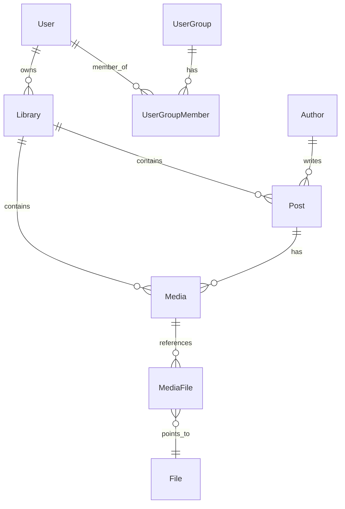

# 系统设计与数据库规范 (简体中文)

> [English](./system_design.md)

本篇文档主要阐述 Stationary 平台的业务模块关系、核心数据库设计原则、双轨制展示机制以及多租户权限隔离方案。

---

## 1. 数据库设计原则

为保证系统在高并发、海量资产导入与同步时的吞吐能力与横向扩展能力，项目在数据库层面遵循以下核心设计规范：

### 1.1 命名规范 (Snake Case)
- 数据库的所有表名、字段名必须**严格使用 `snake_case` (下划线命名法)**。例如：`avatar_file_id`, `create_time`, `sort_order`。
- 注：Better Auth 生成的底层系统表（如 `better_user`, `better_session`）由于依赖库底层映射，保留其默认命名格式，但业务拓展字段及所有新业务表必须遵守 `snake_case`。

### 1.2 无物理外键设计 (No Explicit Foreign Keys)
- **硬性要求**：在 Drizzle ORM 定义中，绝对不允许在列上声明物理外键 `.references()`（除注释说明外）。
- **设计 rationale**：物理外键在分布式或大规模水平扩容时会造成严重的锁竞争与级联操作负担。
- **关联处理**：所有实体关联关系均为**逻辑关联**。关联的维护和业务完整性由应用层逻辑负责，并通过 Drizzle 的 `relations`（在 `relations.ts` 中通过 `defineRelations`）进行声明，以便在 API 层进行便捷的类型推导与 `with` 关联查询。

---

## 2. 核心数据模型关系

Stationary 的底层数据模型非常清晰，主要分为**内容层**、**资产层**、**用户与隔离层**。

### 2.1 内容层关系
- **Author (作者)**：跨平台唯一（通过 `eid` 与 `platform` 联合唯一）。保存多平台博主的昵称、签名及头像文件引用（`avatar_file_id`）。
- **Post (帖子/文章)**：属于某一个 `Library`（媒体库）。是内容的逻辑载体，记录源站的 `eid`、标题、描述、标签等，并由一个 `Author`发布。
- **Media (媒体逻辑实体)**：隶属于某个 `Post`，或作为独立媒体（`post_id` 为 null）。包含排序、标题、描述、媒体类型（IMAGE, VIDEO, LIVE_PHOTO）以及各类原始下载 URL。

### 2.2 资产与物理存储层 (MediaFile & File)
- **File (物理资产表)**：对应 S3 中的真实文件。以 `s3_key` 为主键/唯一索引，包含文件的哈希值、文件大小、宽高、视频时长等元数据，起到防重复下载和排重的作用。
- **MediaFile (媒体文件角色表)**：作为 `Media` 与 `File` 之间的桥梁，表明一个媒体文件在当前媒体中扮演的角色（`role`）：
  - `PRIMARY`：主资产（图片或视频）。
  - `ALTERNATIVE`：备用资产。
  - `LIVE_PHOTO_VIDEO`：Live Photo 所包含的动态视频轨。
  - `COVER`：视频对应的封面图。
- File 是单所有者模型，不支持同一个 File 被多个 Author / Library / MediaFile 共享。
- File 进入 DELETED 只是 tombstone，不代表立刻删 S3。
- 30 天 cron 只负责最终清理。
- [未来] **引用计数与共享规则**：只要存在多个实体引用同一个 `File`，就不能使用单一的 `ref_count` 字段来记录引用计数，而应该使用专门的 `file_usage` 引用表来统计引用关联，以便在删除时能够快速且准确地判定是否存在其他引用。（目前还没有多引用关系，可以暂缓 file_usage 表的实现）。

---

## 3. 生命周期与删除策略 (Lifecycle & Deletion Policies)

在无物理外键的数据库架构下，应用层必须显式维护引用完整性并规范删除流程。

### 3.1 回收站语义 (软删除与硬删除)
为提供数据可恢复性，删除流程分为两阶段：
- **进入回收站 (软删除)**：`Post` 或 `Media` 的首次删除操作被定义为“进入回收站”。在表中通过设置 `delete_time` 标记记录为已删除。此时保留 `post_tag`, `media_tag` 和 `media_file` 关系记录，保留 S3 物理对象。回收站中的内容仍被视为物理文件的有效引用。
- **清空回收站 (硬删除/Purge)**：永久删除操作只发生在用户“清空回收站”或执行“彻底删除”时。物理删除对应的关联记录 (`post_tag`, `media_tag`, `media_file`) 以及 `Post`/`Media` 原始记录。
  - *引用审计与物理清理*：收集已删除 `media_file` 所绑定的候选 `file_id`，查询 `file_usage` 表进行引用计数检查（目前 File 不存在多引用关系，暂不需要考虑引用计数检查）。**仅当该物理文件没有任何其他实体引用时**，才触发 S3 物理对象删除逻辑，并从 `File` 数据表中清除该文件记录。

### 3.2 资源库删除策略
为了防止意外删除，非空的媒体库（Library）不支持直接删除。
- **删除前置检查**：在尝试删除某个资源库 `Library` 之前，系统必须检查该库下是否存在任何 `Post` 或 `Media`，包括回收站中的记录。
- **判定规则**：只要库下仍存留任何内容，系统将拒绝删除请求并提示用户先清空资源库及其回收站。只有在内容完全清空后，才允许删除 `Library` 记录本身。

### 3.3 删除操作执行策略
- **批量删除 `Post` / `Media`**：同步执行，使用小事务，只做数据库状态变更。
- **清空 `Library`**：异步执行，按批次处理，每批使用小事务。
- **S3 物理删除**：永远不在用户请求链路中执行，只由 30 天清理任务处理。
- **`Author` 清理**：暂缓；未来通过独立 orphan cleanup 处理。
- **`Tag` 本体不删除**：删除内容时只硬删除 `post_tag` / `media_tag` 关联。
---

## 4. 双轨制展示机制 (Dual-View System)

在交互层面，平台提供以下两套主要视图：

### 4.1 看板视图 (Board View / Post List)
- 展示是以 `Post` 为主体的流。每个 Card 对应一篇帖子，卡片封面上展示该帖子下 `sort_order` 为 0 的 `Media` 缩略图。
- 能够显示作者信息、帖子标题、多语言的发布时间与帖子包含的媒体总数。

### 4.2 资产视图 (All Pins / Media List)
资产视图允许用户越过 Post 维度，直接在图片/视频层面进行铺展。在此视图下支持**两种布局切换**：

| 布局模式 | 业务筛选逻辑 (SQL Filter) | 展现效果 |
| :--- | :--- | :--- |
| **平铺模式 (Flat)** | 无特殊限制，查询并排列所有 `Media` 记录 | 每一个独立的图片或视频都作为一个单独的 Card 渲染，用户可以高频检索细节资产。 |
| **堆叠模式 (Stacked)** | `or(isNull(Media.post_id), eq(Media.sort_order, 0))` | 将属于同一帖子的多张媒体卡片“折叠”起来。只显示无 Post 的独立媒体，以及每个帖子中的**首个媒体（`sort_order` 为 0）**。卡片上会显示角标（如 `+5`）提示该合辑下还有其他多张图片。 |

---

## 5. 多租户隔离与共享机制 (User Group & Library)

为支持多用户团队协作，系统引入了多级权限控制：

### 5.1 访问资源实体
- **Library (媒体库)**：资产的物理隔离单位。每一个 Post 和 Media（如果关联）在创建时都必须指定所属的 `library_id`。

### 5.2 协作与权限
- 用户拥有独立的 `Library` 实例，亦可建立 `UserGroup` (用户组)。
- 系统支持两个维度的分享授权：
  1. **用户级别分享 (`LibraryUserAccess`)**：将 Library 的查看/编辑权限赋予特定 `User`。
  2. **用户组级别分享 (`LibraryGroupAccess`)**：将 Library 授权给整个 `UserGroup`（组内成员拥有 `LibraryGroupAccess` 定义的相应权限）。
- **权限角色 (AccessRole)**：
  - `VIEWER`：只读权限，可以浏览、搜索和检索资产。
  - `EDITOR`：编辑权限，可以创建/更新 Post、Media 并进行资产移动归档。
  - `ADMIN`：管理权限，除编辑外还可以执行媒体库删除、授权分享管理等高风险操作。
