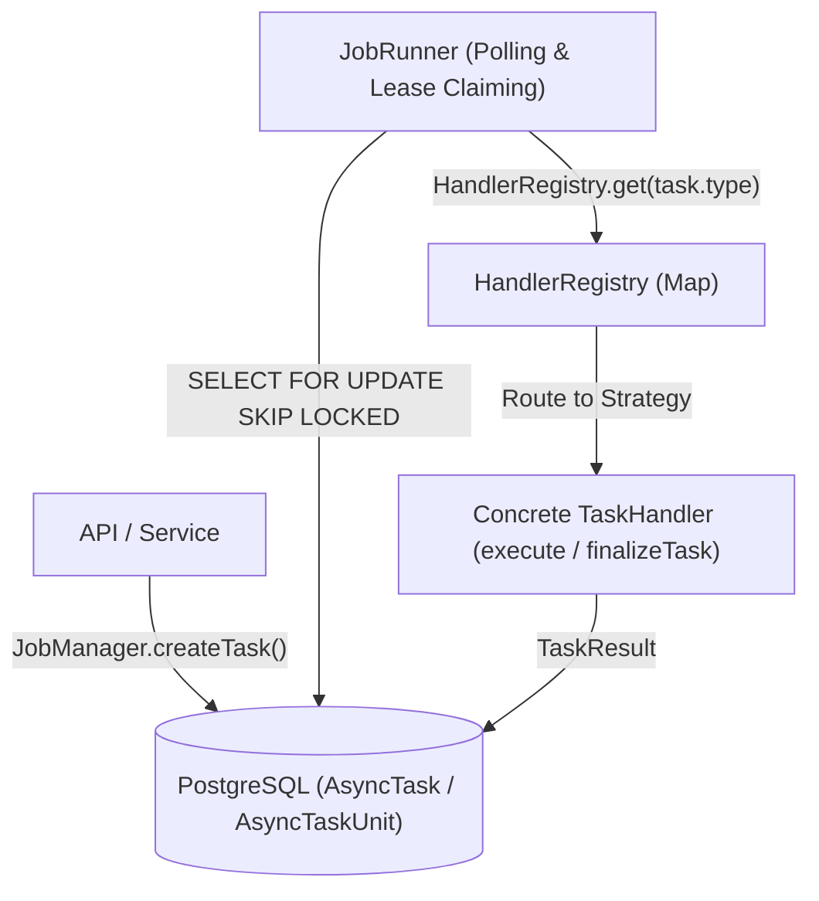

# Task Engine Extension Guide: Adding New Task Types

> [简体中文](./task_engine_extension.zh-Hans.md)

This document provides a guide on how to integrate new task types (`AsyncTaskType`) into Stationary's Durable Background Job Execution Engine.

The engine employs a **Strategy Pattern** and **Registry Pattern** architecture to decouple task scheduling from task execution. Adding a new task type does not require modifying core engine scheduling code—developers simply need to extend the database schema, implement the `TaskHandler` strategy interface, and register the handler at server startup.

---

## 🏗️ Architecture Overview

The job engine uses PostgreSQL as its durable single source of truth (`AsyncTask` master table and `AsyncTaskUnit` unit table), orchestrated by an in-process Bun `JobRunner` and routed via `HandlerRegistry`.



---

## 🛠️ Step-by-Step Integration Guide

### Step 1: Extend Database Task Type Enum (DB Schema & Migration)

Add the new task type key in the database schema.

* **File**: [`apps/server/src/db/schema/index.ts`](../apps/server/src/db/schema/index.ts#L905-L918)
* **Action**:
  1. Add the enum key/value to `AsyncTaskType` TypeScript enum.
  2. Append the new value to `AsyncTaskTypeEnum` (pgEnum definition).
  3. *(Optional)* Extend `AsyncSubjectType` or `AsyncTaskUnitKind` if a new entity type or unit kind is introduced.

```typescript
// apps/server/src/db/schema/index.ts

export enum AsyncTaskType {
    COVER_RECONCILE = "COVER_RECONCILE",
    COVER_BATCH = "COVER_BATCH",
    POST_PROCESS = "POST_PROCESS",
    AI_ENRICH = "AI_ENRICH",
    AVATAR_COPY = "AVATAR_COPY",
    NEW_FEATURE_JOB = "NEW_FEATURE_JOB", // 1. Add new enum key
}

export const AsyncTaskTypeEnum = pgEnum("async_task_type", [
    AsyncTaskType.COVER_RECONCILE,
    AsyncTaskType.COVER_BATCH,
    AsyncTaskType.POST_PROCESS,
    AsyncTaskType.AI_ENRICH,
    AsyncTaskType.AVATAR_COPY,
    AsyncTaskType.NEW_FEATURE_JOB, // 2. Add to pgEnum array
]);
```

> ⚠️ **Note**: Run database migrations after updating the schema:
> ```bash
> bun run db:migrate
> ```

---

### Step 2: Implement `TaskHandler` Strategy Interface

Create a handler implementation in `apps/server/src/services/job_handlers/`.

* **Example Path**: `apps/server/src/services/job_handlers/new_feature_handler.ts`
* **Interface Specification**: [`apps/server/src/infra/jobs/types.ts`](../apps/server/src/infra/jobs/types.ts#L48-L61)
* **Implementation Example**:

```typescript
import type { TaskHandler, TaskUnitContext, TaskResult, TaskExecutionSummary } from "@/infra/jobs/types";
import { getErrorMessage } from "@/lib/utils/error";

export const NewFeatureHandler: TaskHandler = {
    /**
     * (Optional) Validate and sanitize inputSnapshot.
     */
    validateInput(input: Record<string, unknown>): Record<string, unknown> {
        if (!input.target_id) {
            throw new Error("Missing required field 'target_id'");
        }
        return input;
    },

    /**
     * (Optional) Dynamic discovery step for dynamic batch scanning jobs.
     */
    // async discoverUnits(task, discoveryCursor, batchSize) { ... },

    /**
     * (Required) Core unit execution handler.
     */
    async execute(context: TaskUnitContext): Promise<TaskResult> {
        // Check for cancellation signal
        context.signal.throwIfAborted();

        const unit = context.unit;
        const subjectId = unit.subject_id;

        try {
            // Perform async business logic here...
            
            context.signal.throwIfAborted();

            return { success: true };
        } catch (error) {
            return {
                success: false,
                error: getErrorMessage(error),
                retryable: true, // Allow engine to retry upon error
            };
        }
    },

    /**
     * (Optional) Finalizer hook executed when master task reaches terminal status.
     */
    async finalizeTask(tx, task, summary: TaskExecutionSummary): Promise<void> {
        if (summary.failedUnits > 0) {
            // Reconcile status or update failure records in DB
        }
    },
};
```

---

### Step 3: Register the Strategy in HandlerRegistry

Register the new handler strategy at application startup.

* **File**: [`apps/server/src/services/job_handlers/index.ts`](../apps/server/src/services/job_handlers/index.ts)
* **Action**: Call `registerTaskHandler` inside `initJobHandlers()`.

```typescript
// apps/server/src/services/job_handlers/index.ts

import { registerTaskHandler } from "@/infra/jobs/registry";
import { AsyncTaskType } from "@/db/schema";
import { NewFeatureHandler } from "@/services/job_handlers/new_feature_handler";

export function initJobHandlers() {
    if (initialized) return;
    initialized = true;

    registerTaskHandler(AsyncTaskType.COVER_RECONCILE, CoverJobHandler);
    registerTaskHandler(AsyncTaskType.COVER_BATCH, CoverJobHandler);
    registerTaskHandler(AsyncTaskType.POST_PROCESS, PostProcessHandler);
    registerTaskHandler(AsyncTaskType.AI_ENRICH, AiEnrichHandler);
    registerTaskHandler(AsyncTaskType.AVATAR_COPY, AvatarCopyHandler);
    
    // Register the new task handler strategy
    registerTaskHandler(AsyncTaskType.NEW_FEATURE_JOB, NewFeatureHandler);
}
```

---

### Step 4: Dispatch Tasks (`JobManager`)

Trigger new tasks from API handlers or services.

```typescript
import { JobManager } from "@/infra/jobs/manager";
import { AsyncTaskType, AsyncTaskUnitKind, AsyncSubjectType } from "@/db/schema";

// Dispatch task with pre-determined units
const masterTask = await JobManager.enqueueTaskWithUnits(
    {
        type: AsyncTaskType.NEW_FEATURE_JOB,
        libraryId,
        inputSnapshot: { batch_name: "ExportJob" },
    },
    [
        {
            unitKey: "unit-1",
            kind: AsyncTaskUnitKind.SINGLE_RUN,
            subjectType: AsyncSubjectType.MEDIA,
            subjectId: mediaId,
        },
    ],
);
```

---

## 📌 Development Rules & Conventions

1. **Idempotency**: Execution logic in `execute` must be idempotent as the engine guarantees At-Least-Once execution.
2. **Cancellation Signal**: Regularly check `context.signal.throwIfAborted()` in long-running jobs.
3. **Temporal API**: Never use native JS `new Date()`. Use `@js-temporal/polyfill`.
4. **Soft-delete Check**: Check `delete_status = DeleteStatus.ACTIVE` when fetching entities.
5. **Formatting**: Format code using `oxc` before committing.
