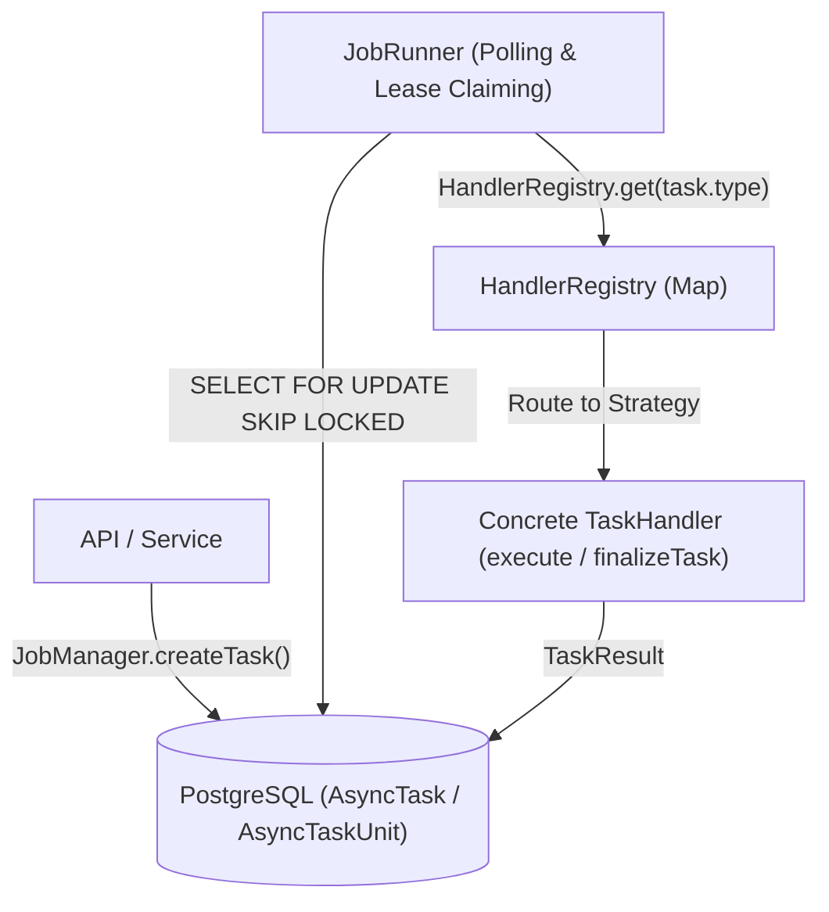

# 任务引擎接入指南：新增任务类型 (Task Engine Extension Guide)

> [English](./task_engine_extension.md)

本文档旨在介绍如何为 Stationary 的后台任务执行引擎（Durable Background Job Engine）接入新的任务类型（`AsyncTaskType`）。

系统采用了**策略模式（Strategy Pattern）**与**注册表模式（Registry Pattern）**解耦设计，使得新增任务类型时无需修改核心调度引擎的代码，只需按照标准接口规范扩展 Schema、实现 `TaskHandler` 策略并在服务启动时注册即可。

---

## 🏗️ 任务引擎架构概述

任务引擎以 PostgreSQL 作为持久化唯一事实来源（`AsyncTask` 主任务表与 `AsyncTaskUnit` 任务单元表），由 Bun 进程内的轻量级 `JobRunner` 负责调度，并通过 `HandlerRegistry` 路由到具体的策略对象。



---

## 🛠️ 接入新任务类型的标准步骤

接入一个全新的任务类型，需要完成以下四个核心步骤：

### Step 1: 扩充数据库任务类型枚举 (DB Schema & Migration)

在数据库 Schema 定义中新增任务类型枚举项。

* **文件路径**：[`apps/server/src/db/schema/index.ts`](../apps/server/src/db/schema/index.ts#L905-L918)
* **操作**：
  1. 在 `AsyncTaskType` TypeScript 枚举中添加新类型的标识符（例如 `NEW_FEATURE_JOB`）。
  2. 在 `AsyncTaskTypeEnum` (pgEnum 定义) 中追加该枚举项。
  3. *(可选)* 若任务面向新的主实体或单元类型，同步扩充 `AsyncSubjectType` 或 `AsyncTaskUnitKind`。

```typescript
// apps/server/src/db/schema/index.ts

export enum AsyncTaskType {
    COVER_RECONCILE = "COVER_RECONCILE",
    COVER_BATCH = "COVER_BATCH",
    POST_PROCESS = "POST_PROCESS",
    AI_ENRICH = "AI_ENRICH",
    AVATAR_COPY = "AVATAR_COPY",
    NEW_FEATURE_JOB = "NEW_FEATURE_JOB", // 1. 追加新枚举项
}

export const AsyncTaskTypeEnum = pgEnum("async_task_type", [
    AsyncTaskType.COVER_RECONCILE,
    AsyncTaskType.COVER_BATCH,
    AsyncTaskType.POST_PROCESS,
    AsyncTaskType.AI_ENRICH,
    AsyncTaskType.AVATAR_COPY,
    AsyncTaskType.NEW_FEATURE_JOB, // 2. 同步追加到 pgEnum 列表
]);
```

> ⚠️ **注意**：修改 Schema 后需在 `apps/server` 目录下运行数据库迁移同步命令：
> ```bash
> bun run db:migrate
> ```

---

### Step 2: 实现 `TaskHandler` 策略接口

在 `apps/server/src/services/job_handlers/` 目录下新建对应的 Handler 文件。

* **文件路径示例**：`apps/server/src/services/job_handlers/new_feature_handler.ts`
* **接口定义**：[`apps/server/src/infra/jobs/types.ts`](../apps/server/src/infra/jobs/types.ts#L48-L61)
* **规范与实现**：

```typescript
import type { TaskHandler, TaskUnitContext, TaskResult, TaskExecutionSummary } from "@/infra/jobs/types";
import { getErrorMessage } from "@/lib/utils/error";

export const NewFeatureHandler: TaskHandler = {
    /**
     * (可选) 任务输入参数校验与规范化
     */
    validateInput(input: Record<string, unknown>): Record<string, unknown> {
        if (!input.target_id) {
            throw new Error("Missing required field 'target_id'");
        }
        return input;
    },

    /**
     * (可选) 动态任务单元发现阶段
     * 适用于无法在创建时预知所有子单元的大批量扫描/同步任务
     */
    // async discoverUnits(task, discoveryCursor, batchSize) {
    //     ...
    // },

    /**
     * (必须) 单个任务单元的核心执行逻辑
     */
    async execute(context: TaskUnitContext): Promise<TaskResult> {
        // 1. 检查取消/中断信号
        context.signal.throwIfAborted();

        const unit = context.unit;
        const subjectId = unit.subject_id;

        try {
            // 2. 执行具体的异步业务逻辑...
            
            // 如果长时间运行，可以调用续租方法更新 lease 锁
            // await context.renewLease(60);

            context.signal.throwIfAborted();

            return { success: true };
        } catch (error) {
            // 3. 返回失败结果并指定 retryable (是否允许引擎根据策略重试)
            return {
                success: false,
                error: getErrorMessage(error),
                retryable: true,
            };
        }
    },

    /**
     * (可选) 主任务终态完成/失败回调钩子
     */
    async finalizeTask(tx, task, summary: TaskExecutionSummary): Promise<void> {
        if (summary.failedUnits > 0) {
            // 批量更新数据库相关实体的状态或进行清理工作
        }
    },
};
```

---

### Step 3: 在注册表中进行策略绑定

在后端服务器初始化时，将新增的 `AsyncTaskType` 与对应的 `TaskHandler` 实现进行绑定。

* **文件路径**：[`apps/server/src/services/job_handlers/index.ts`](../apps/server/src/services/job_handlers/index.ts)
* **操作**：在 `initJobHandlers()` 中调用 `registerTaskHandler`。

```typescript
// apps/server/src/services/job_handlers/index.ts

import { registerTaskHandler } from "@/infra/jobs/registry";
import { AsyncTaskType } from "@/db/schema";
import { NewFeatureHandler } from "@/services/job_handlers/new_feature_handler";

export function initJobHandlers() {
    if (initialized) return;
    initialized = true;

    registerTaskHandler(AsyncTaskType.COVER_RECONCILE, CoverJobHandler);
    registerTaskHandler(AsyncTaskType.COVER_BATCH, CoverJobHandler);
    registerTaskHandler(AsyncTaskType.POST_PROCESS, PostProcessHandler);
    registerTaskHandler(AsyncTaskType.AI_ENRICH, AiEnrichHandler);
    registerTaskHandler(AsyncTaskType.AVATAR_COPY, AvatarCopyHandler);
    
    // 绑定新的任务处理器策略
    registerTaskHandler(AsyncTaskType.NEW_FEATURE_JOB, NewFeatureHandler);
}
```

---

### Step 4: 触发与调度任务 (Dispatch & Enqueue)

在 API 路由（如 `apps/server/src/api/`）或业务服务层通过 `JobManager` 入队新任务。

* **模式 A：固定任务单元提交 (`enqueueTaskWithUnits`)**

```typescript
import { JobManager } from "@/infra/jobs/manager";
import { AsyncTaskType, AsyncTaskUnitKind, AsyncSubjectType } from "@/db/schema";

const masterTask = await JobManager.enqueueTaskWithUnits(
    {
        type: AsyncTaskType.NEW_FEATURE_JOB,
        libraryId,
        inputSnapshot: { batch_name: "ExportJob" },
    },
    [
        {
            unitKey: "unit-1",
            kind: AsyncTaskUnitKind.SINGLE_RUN,
            subjectType: AsyncSubjectType.MEDIA,
            subjectId: mediaId,
        },
    ],
);
```

* **模式 B：动态单元发现提交 (`createTask`)**

```typescript
const task = await JobManager.createTask({
    type: AsyncTaskType.NEW_TASK_TYPE,
    libraryId,
    ownerId,
    inputSnapshot: { target_id: "123" },
    idempotencyKey: `new_task:${targetId}`, // 支持幂等去重
});
```

---

## 📌 核心开发规范与注意事项

1. **业务副作用幂等性 (Idempotency)**：
   由于队列提供“至少一次（At-Least-Once）”执行保证，`execute` 方法可能因网络超时或 Worker 重启被多次调用，Handler 中的写操作与外部服务调用必须具备幂等性。
2. **正确响应 `AbortSignal`**：
   在 `execute` 方法中，耗时操作前/后应频繁检查 `context.signal.throwIfAborted()`，确保任务被取消或暂停时能迅速释放 CPU 和网络资源。
3. **禁用原生 `Date` 对象**：
   项目严格禁止使用 JavaScript 原生 `new Date()` 构造函数。所有时间与时区操作必须统一使用 `@js-temporal/polyfill` (`Temporal API`)。
4. **软删除状态过滤**：
   查询实体时必须判断 `delete_status = DeleteStatus.ACTIVE`，避免处理已进回收站的数据。
5. **代码格式化**：
   提交前请使用 `oxc` 规范格式化代码文件。
